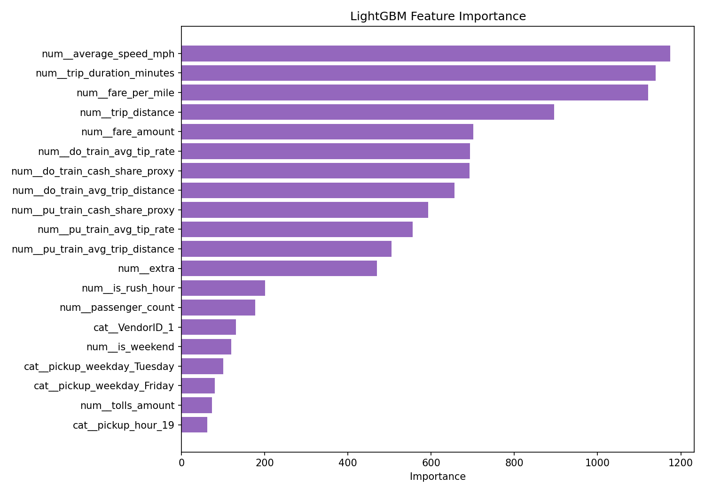
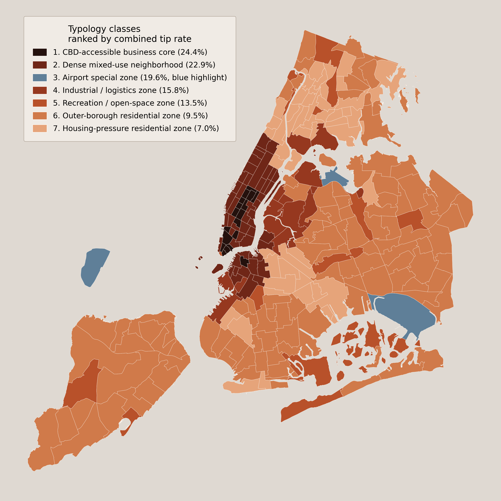
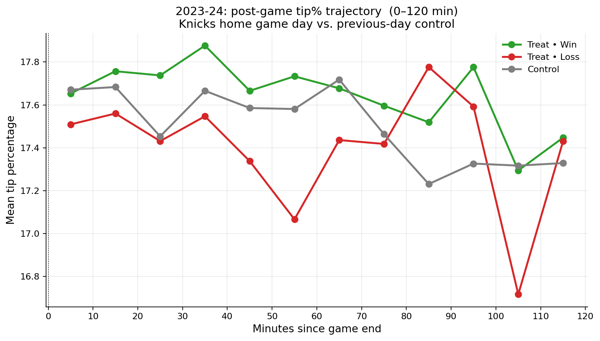
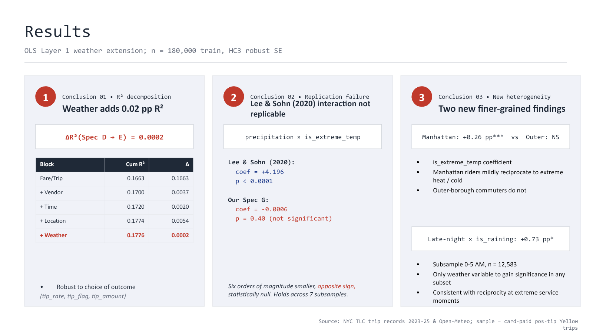

# NYC Taxi Multimodal Data Analytics

This course project examines NYC taxi tipping through four parallel analytical lenses. Taxi records provide the common outcome, while trip structure, urban context, basketball events, and weather provide distinct explanations of when and where tipping patterns change.

The repository is a compact project showcase. It retains final scripts, selected result tables, and presentation-ready figures while excluding raw trip data, large intermediate files, notebooks, logs, caches, and superseded drafts.

## Four analytical lenses

| Lens | Research question | Main methods | Headline result |
| --- | --- | --- | --- |
| Taxi-record baseline | Which trip, fare, vendor, time, and route variables are most useful for explaining tip rate? | Descriptive analysis, robust OLS, two-part modeling, LightGBM benchmark | Fare and trip characteristics dominate predictive importance; nonlinear modeling improves held-out R-squared from about 0.150 to 0.213. |
| Urban spatial context | What types of Taxi Zones exist, and what spatial signal remains after trip-composition controls? | Multisource spatial integration, KMeans typology, weighted residual models, shallow trees | Business-core and dense mixed-use zones have the highest raw tip rates, but the remaining tree signal is weak out of sample after controls. |
| Knicks game events | Do game outcomes and outcome surprise affect tipping near Madison Square Garden? | Pre/post event study, difference-in-differences, surprise and point-spread interactions | Positive 2023-24 estimates do not generalize cleanly across three pooled seasons; the event effect is season-sensitive. |
| Weather context | Does weather add explanatory power beyond trip, time, vendor, and location controls? | Nested OLS, Logit, interaction tests, subgroup analysis | Weather adds only 0.0002 to R-squared; a few subgroup effects exist, but the overall economic contribution is small. |

## Selected findings

- In the taxi-only baseline, the LightGBM test R-squared is `0.213`, compared with `0.150` for the full OLS specification. Fare and trip variables account for most grouped permutation importance.
- The spatial analysis identifies six non-airport urban classes plus an airport special class. CBD-accessible business cores and dense mixed-use neighborhoods lead the raw tip-rate ranking.
- Pickup and dropoff residual models absorb most zone-month variation (`R² = 0.966` and `0.943`), but shallow-tree cross-validation is negative. Residual tree rules are exploratory summaries, not strong predictors.
- For Knicks home games, the 2023-24 ride-adjusted win estimate is `+0.85` percentage points, but the comparable pooled estimate is not significant. Full pooled controls also remove the apparent upset-win effect.
- Adding weather to the trip, vendor, time, and location model increases R-squared by only `0.0002`. The precipitation-by-extreme-temperature interaction is not significant across tip rate, tip probability, or tip amount.

## Project figures

### Taxi-record baseline



### Urban spatial context



### Knicks game events



### Weather context



## Repository contents

```text
scripts/                         Final model and spatial-analysis scripts
reports/                         Integrated methodology and findings report
results/baseline/                Taxi-only benchmark metrics
results/typology/                Spatial cluster summaries and zone labels
results/residual_trees/          Residual models, tree diagnostics, and rules
results/knicks_event_study/      Game-event summaries and selected estimates
results/weather_effects/         Weather-model estimates and interpretation
results/figures/                 Selected figures from all four lenses
```

## Key outputs

- [Integrated methodology and findings](reports/methodology_and_findings_en.md)
- [Taxi baseline metrics](results/baseline/key_metrics.csv)
- [Taxi Zone typology summary](results/typology/typology_cluster_summary.csv)
- [Residual-model summary](results/residual_trees/residual_model_summary.csv)
- [Knicks event-study estimates](results/knicks_event_study/key_estimates.csv)
- [Weather-effect estimates](results/weather_effects/key_estimates.csv)

## Study scope

| Analysis | Coverage | Main analytical sample |
| --- | --- | --- |
| Taxi baseline | Saved benchmark output from January 2024 | 2.19 million positive-tip, card-paid trips before modeling subsamples |
| Spatial context | January 2023-December 2025 | 9,360 pickup and 9,360 dropoff zone-month rows across 260 Taxi Zones |
| Knicks events | 2022-23 through 2024-25 | 144 Knicks home games and MSG-area, card-paid taxi trips |
| Weather | 2023-2025 | Yellow Taxi card-paid trips joined to hourly NYC weather; fixed modeling subsamples used for estimation |

## Interpretation boundaries

- The four lenses are complementary and equally important to the project narrative, but they use different units of analysis and should not be combined into a single causal estimate.
- Card tips are better recorded than cash tips, so payment mode is both a behavioral variable and a measurement constraint.
- The spatial typology and residual trees are descriptive. They do not establish neighborhood-level causal effects.
- Knicks game timing and some betting expectations are approximated, and the strongest event findings are not stable across seasons and specifications.
- Severe weather is rare, and weather explains little incremental variance after conventional controls.
